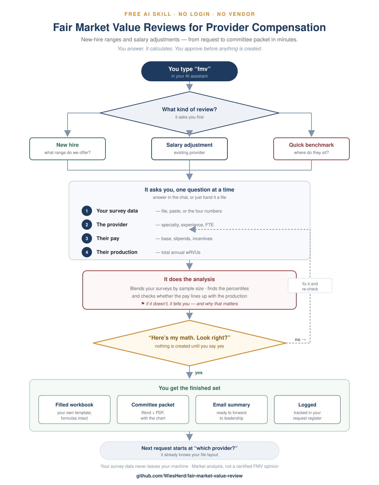
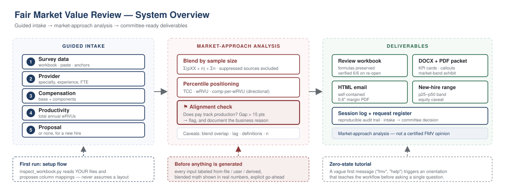
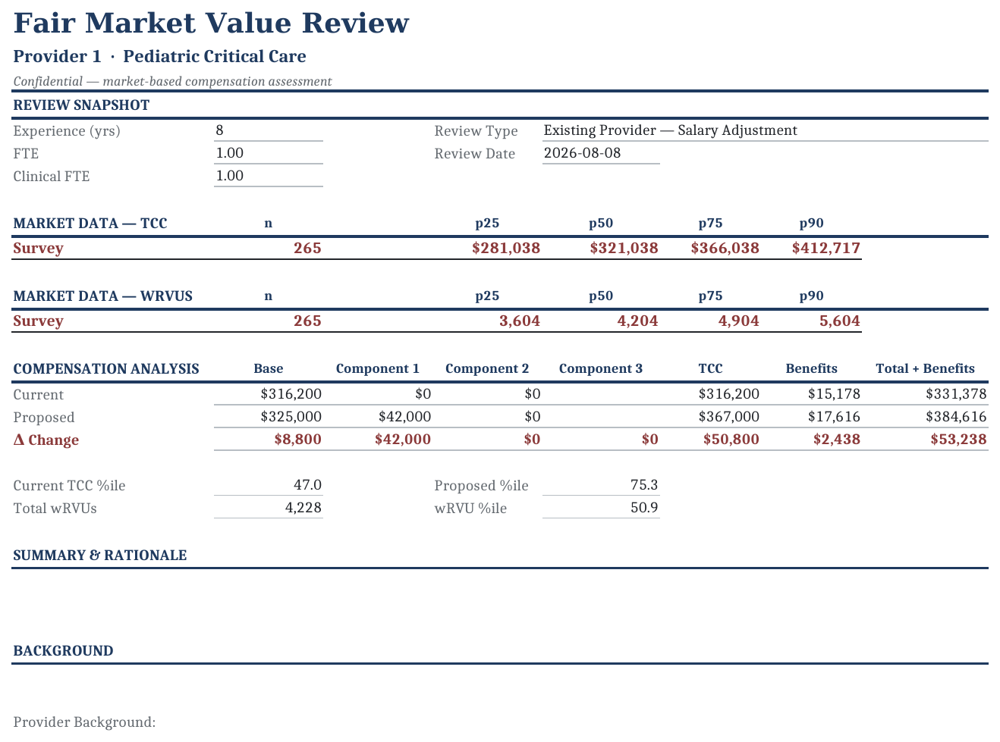
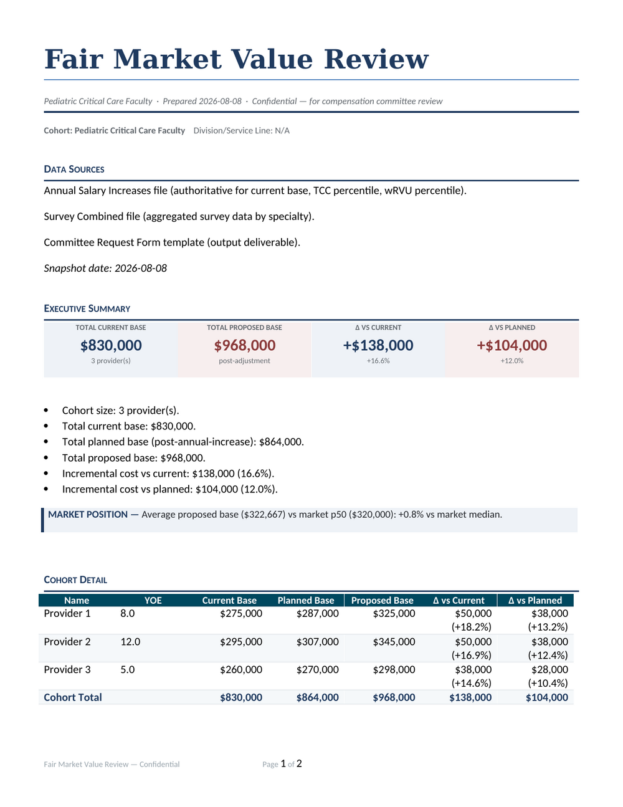
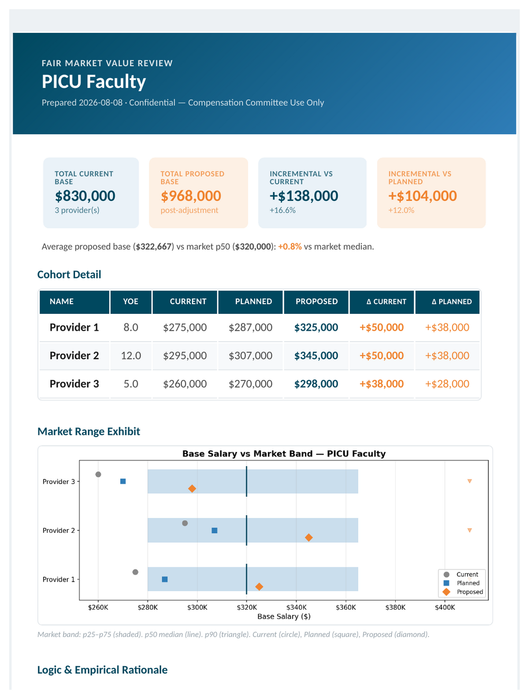
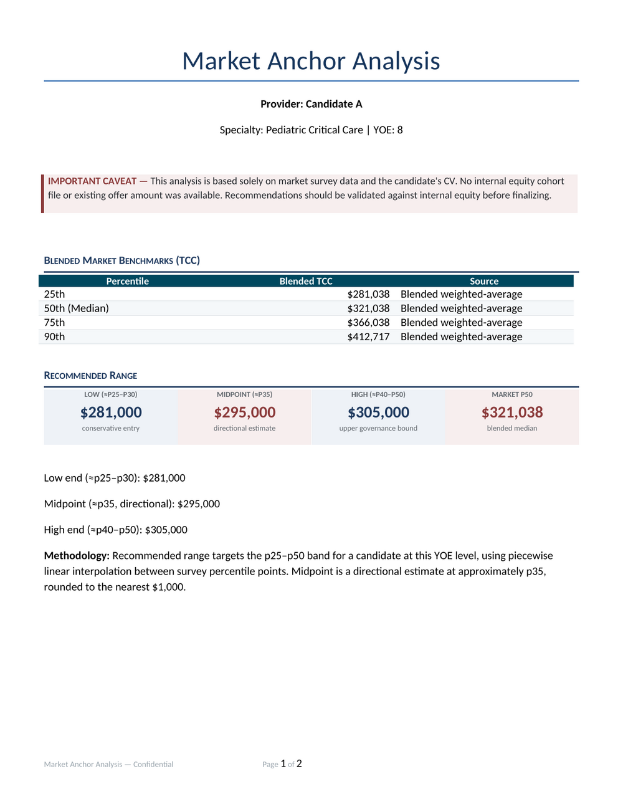
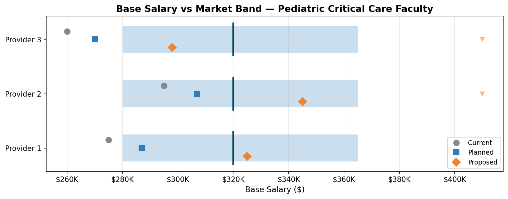
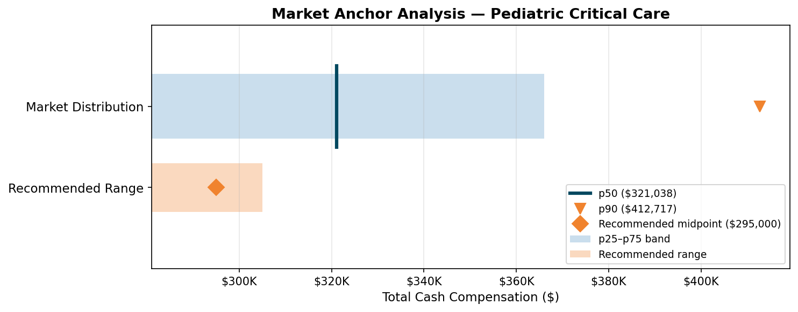

# Fair Market Value Review


**A guided AI skill for provider compensation teams.** New-hire ranges and salary
adjustments — from request to committee packet in minutes. You answer, it calculates,
and you approve before anything is created.



## How It Works



The agent runs a **guided intake** (one question at a time, file or typed answer at every
step), performs the **market-approach analysis** (sample-size-weighted blending, percentile
positioning, and the compensation-to-productivity alignment check), and produces
**committee-ready deliverables**: each logged to a session audit trail and a request
register. Nothing is generated until the blended math has been shown and approved.

## What The Output Looks Like

**FMV Review workbook**: provider and subspecialty in the subheader, blended Survey row per measure, one Current/Proposed/Δ comparison grid:



**Review packet (DOCX/PDF)**: KPI cards, market-position callout, cohort totals:



**Email-ready HTML**: self-contained, embedded exhibit, 0.6" PDF export:



**New-hire market range**: recommended band with a red-flagged internal-equity caveat:



**Market-band exhibits:**





All generated from the synthetic data in `examples/` — not mockups. Screenshot filenames
carry a content hash so an updated image always gets a fresh URL.


## What It Does

Four deliverables, from the same guided intake:

1. **FMV Review workbook fill.** Fills your own two-sheet review workbook (FMV Review +
   Tracker) with provider data, the blended survey row, and live percentile formulas.
   Specialty benchmarks are looked up automatically. Every formula already in your
   template is preserved, and the saved file is re-opened and verified.

2. **Review packet (DOCX + PDF).** Eight sections: data sources, executive summary,
   cohort detail, market-band exhibit, rationale, cost impact, governance notes,
   footnotes.

3. **New-hire market range.** When you have a candidate and no offer yet, produces a
   market-anchored range and exhibit, flagged that internal equity has not been
   considered.

4. **Email-ready HTML report.** One self-contained file with the exhibit embedded, so it
   pastes into an email intact. Exports a PDF with 0.6" margins if WeasyPrint is installed.

## Key Features

- **Blending by sample size.** Weighted across whichever survey sources carry data;
  sources with suppressed data are excluded.
- **Alignment check.** Compares compensation positioning against productivity
  positioning and flags material gaps, since no percentile is inherently fair market value.
- **Percentile interpolation**, labeled directional, because survey distributions are not
  linear between published points.
- **Formula preservation.** Your template's own benefits and total formulas are never
  overwritten, only the inputs they read.
- **Specialty matching** that handles the ASCII hyphen versus Unicode en-dash mismatch
  between roster and survey exports.
- **Encrypted file support** for `.dec` portal-encrypted workbooks.

## Installation

### For Hermes Agent
```bash
hermes skills install https://github.com/YOUR_USERNAME/comp-adjustment-request
```

### For other AI agents
Point your agent at this repo. The `SKILL.md` file is the entry point — it contains
the full workflow, trigger conditions, implementation recipe, and pitfalls.

## Requirements

```bash
pip install openpyxl python-docx matplotlib
# Optional: LibreOffice (soffice) for PDF export
```

## Quick Start

### Try it now with the included example data (no org files needed)

Everything below runs immediately after cloning — `examples/` contains fictional
salary, survey, and template files in the expected formats:

```bash
pip install -r requirements.txt

# Committee Excel template fill (both sheets, formulas preserved + verified)
python3 scripts/fmv_workbook_generator.py \
  --name "Provider 1" \
  --salary-file examples/example_salary_file.xlsx \
  --survey-file examples/example_survey_combined.xlsx \
  --template examples/example_fmv_template.xlsx \
  --proposed-base 325000 --stipend 42000 --wrvu 4228 --track-num 100026 \
  --no-academic-rank --output committee_request.xlsx

# Cohort adjustment packet (DOCX + PDF + exhibit + CSV)
python3 scripts/build_adjustment_report.py --config examples/example_config.json

# Email-ready HTML report (same numbers, KPI cards, embedded exhibit, 0.6" PDF margins)
python3 scripts/build_html_email.py --config examples/example_config.json

# CV-only market anchor (recommended range from survey data + a CV)
python3 scripts/build_cv_only_market_anchor.py \
  --name "Provider 1" --specialty "Pediatric Critical Care" --yoe 8 \
  --survey-file examples/example_survey_combined.xlsx --output-dir ./anchor_out

# Confirm everything works
python3 -m pytest tests/ -q
```

For the full analyst scenario tying these together, see [WALKTHROUGH.md](WALKTHROUGH.md).

### Committee Template Fill (recommended)
```bash
# 1. Copy the config template
cp templates/request_config.json my_request.json

# 2. Edit values (name, file paths, proposed base, etc.)
vim my_request.json

# 3. Run
python3 scripts/fmv_workbook_generator.py --config my_request.json --output output.xlsx
```

### Standard Report (DOCX + PDF)
```bash
python3 scripts/build_adjustment_report.py \
  --name "Pediatric Critical Care" \
  --providers-file cohort.tsv \
  --market-anchors-file anchors.json \
  --output report.docx
```

### CV-Only Market Anchor
```bash
python3 scripts/build_cv_only_market_anchor.py \
  --name "Provider 1" \
  --specialty "Pediatric Critical Care" \
  --yoe 8 \
  --survey-file survey_combined.xlsx \
  --output-dir ./output
```

## File Structure
```
comp-adjustment-request/
├── SKILL.md                                    # Skill definition (entry point for AI agents)
├── README.md                                   # This file
├── WALKTHROUGH.md                              # Real-world analyst scenario, start to finish
├── requirements.txt                            # Dependencies (weasyprint optional, for HTML->PDF)
├── scripts/
│   ├── fmv_workbook_generator.py         # Excel template fill (30-second workflow)
│   ├── build_adjustment_report.py              # DOCX/PDF report + exhibit
│   ├── build_cv_only_market_anchor.py          # CV-only market anchor mode
│   ├── build_html_email.py                     # Email-ready HTML report (+ 0.6" margin PDF)
│   ├── docx_style_helpers.py                   # Shared DOCX styling (shaded headers, banded rows, footers)
│   └── generate_example_xlsx_fixtures.py       # Regenerates examples/*.xlsx from scratch
├── examples/                                   # Fictional data -- every Quick Start command runs on these
│   ├── example_salary_file.xlsx / example_survey_combined.xlsx / example_fmv_template.xlsx
│   ├── example_cohort.tsv / example_anchors.json / example_config.json
│   └── README.md
├── docs/screenshots/                           # Real rendered output shown in this README
├── tests/                                      # 96 pytest tests + mock fixtures
├── templates/
│   └── request_config.json                     # JSON config template
└── references/
    ├── fmv-workbook-cell-map.md              # Cell mapping & formula reference
    ├── survey-combined-file-structure.md        # Survey file layout & dash pitfall
    ├── cv-only-market-anchor.md                 # CV-only workflow notes
    └── example-review.md              # Worked example with language patterns
```

## Configuration

### Config File (`request_config.json`)
| Field | Description |
|-------|-------------|
| `name` | Provider name (Last, First) |
| `salary_file` | Annual Salary Increases Excel file |
| `survey_file` | Survey Combined Excel file (preferred — auto-looks up benchmarks) |
| `template` | Committee Excel template |
| `proposed_base` | Proposed base salary (number) |
| `stipend` | Proposed stipend amount |
| `wrvu` | total annual wRVUs (sum of work RVUs produced) |
| `request_type` | "Existing" or "Incr New" |
| `output` | Output file path |

See `templates/request_config.json` for all fields.

### Script Constants
Each script has configurable constants at the top (sheet names, column mappings,
benefits rate). Adjust these to match your organization's file layouts.

## Methodology

### Benchmark Blending
Blended benchmark = weighted average across available survey sources by n-count:
```
blended_p50 = (SC_p50 × SC_n + Survey 3_p50 × Survey 3_n + Survey 2_p50 × Survey 2_n) /
              (SC_n + Survey 3_n + Survey 2_n)
```

Sources with suppressed data (n=0) are excluded from the blend.

### Percentile Interpolation
When a reference file provides p25/p50/p75/p90 but not a specific percentile,
piecewise linear interpolation is used:
- Between p25 and p50: `25 + (value - p25) / (p50 - p25) × 25`
- Between p50 and p75: `50 + (value - p50) / (p75 - p50) × 25`
- Between p75 and p90: `75 + (value - p75) / (p90 - p75) × 15`

This is labeled as **directional**: survey distributions are not linear between points.

## Pitfalls (Documented in SKILL.md)

- **Dash mismatch:** salary files use ASCII `-`, survey files use Unicode `–` (U+2013)
- **Name matching:** normalize "Last, First" vs "First Last"
- **Do not FTE-adjust** governance percentiles — part-time lower positioning is correct
- **Benefits rate** varies by organization — read from template or ask
- **Suppressed data:** `*`, `None`, `0` → treated as no data

## License

MIT — see [LICENSE](LICENSE).

## Contributing

Pull requests welcome. If your organization uses a different Excel template layout,
the cell mappings in `fmv_workbook_generator.py` are configurable via constants
at the top of the file.